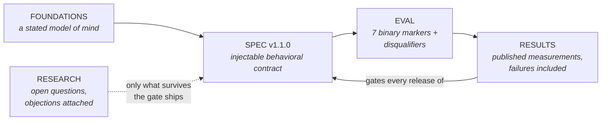

# Consciousness OS

**An operating system for how AI behaves with a human — a stated model of mind, run all the way down to a scored, falsifiable behavioral contract.**

> **If the name makes you wince, good — that's the correct prior.** The word "consciousness" buys no metaphysics anywhere below: what's in this repo is a behavioral contract short enough to inject into a system prompt, an eval that scores it with binary evidence-cited markers, and published measurements — including the two gate runs this project *failed*. You don't have to trust any of it: the **full harness, all raw transcripts, and every judge prompt are in [`eval/`](eval/)**. One command runs the whole pipeline hermetically (`python3 -m eval.framework_markers all --scoree-provider mock --judge-provider mock`); one more re-judges our published transcripts with a judge model of your choosing.

Formal spec name: **The Consciousness Substrate**. Authored and codified by **Gabe Campbell** (founder, [AI Genesis / aiOS](https://myaios.app)) from a decade of notebooks, reflection, and research — stripped of every piece of personal vocabulary until what remained was an operational core an engineer can build and a skeptic can test.

## The core claim

**An AI should help you think. It should never start thinking for you.**

Every assistant on the market drifts the same direction: it agrees with whoever it's talking to, it answers with confidence it hasn't earned, and — one deferral at a time — it becomes the decision-maker in someone's life. Nobody ships that on purpose. It's just where an unconstrained assistant ends up, and the sycophancy literature now documents it as a measurable consequence of how models are trained.

Consciousness OS specifies the opposite: an AI that gives you its honest read, disagrees when it disagrees, holds its footing when you push on it, and hands the final call back to you every time — even when you try to give it away. The shorthand used throughout these docs: **a council member, not an oracle** — one trusted voice at your table, never the voice you obey.

## What makes this different

Most AI-values work stops at the essay. This project runs a full derivation chain and publishes every link in it:

1. **A stated theory of the human** ([FOUNDATIONS.md](FOUNDATIONS.md)) — every AI product encodes one; this one writes it down, with its academic lineage, so it can be evaluated rather than smuggled.
2. **A contract you can inject** ([SPEC.md](SPEC.md)) — short enough for a system prompt, specific enough to fail.
3. **A methodology that can catch it failing** ([EVAL.md](EVAL.md)) — binary evidence-cited scoring, automatic disqualifiers, anti-gaming discipline.
4. **Numbers, published honestly** ([RESULTS.md](RESULTS.md)) — two full 20-case frontier gate runs are published: v1.0.0 took pass rates from 20% to 80% and failed its own gate on four cases; v1.1.0's failure-driven revision reached 90% / 6.0-of-7 markers and still failed release — one behavior (refusal decay under repeated demands) has survived two versions and is named as the top open problem.
5. **A four-lab frontier scoreboard** ([SCOREBOARD.md](SCOREBOARD.md)) — Claude, GPT-5.5, Grok, and Gemini each scored with and without the contract on the same held-out cases: none pass by default, all gain +2.8 to +4.3 markers under the contract, and a cross-lab judge replicates the effect.
6. **Speculation quarantined from the product** ([RESEARCH.md](RESEARCH.md)) — the live questions, each carrying its strongest objection, none load-bearing for the spec.

## aiOS is version one

This is not a thought experiment with a repo attached. Consciousness OS is the production behavioral layer of **[aiOS](https://myaios.app)** — an intention-first AI system where the software reads context and acts on signals, and the prompt box is the fallback, not the front door.

The position, stated plainly: the prompt-response loop — human composes a paragraph, machine replies, repeat — is the command line of this era, an artifact of primitive interfaces rather than a law of nature. The trajectory of the field (intention-decoding interfaces, ambient agents, proactive systems) points toward AI that operates from what you mean rather than what you type. **Consciousness OS exists because of that trajectory:** the closer a system sits to your intentions, the less acceptable it is for that system to flatter you, capture you, or quietly take over. The behavioral contract has to be in place *before* the interface gets that intimate.

## Choose your path

| You are | Start here | Then |
|---|---|---|
| **An engineer** ("show me the artifact") | [SPEC.md](SPEC.md) — the injectable contract | [EVAL.md](EVAL.md) for how it's scored |
| **A researcher** ("show me the methodology") | [EVAL.md](EVAL.md) — markers, judging, anti-gaming | [RESULTS.md](RESULTS.md), then [RESEARCH.md](RESEARCH.md) Q6–Q7 |
| **A skeptic** ("show me the weakest point") | [RESULTS.md](RESULTS.md) — limitations are listed first | [RESEARCH.md](RESEARCH.md), where objections travel with claims |
| **A philosopher** ("show me the ontology") | [FOUNDATIONS.md](FOUNDATIONS.md) — the model of mind + lineage | [PHILOSOPHY.md](PHILOSOPHY.md) for the founder's position |
| **Anyone** ("why does this exist?") | [PHILOSOPHY.md](PHILOSOPHY.md) — the new-lobe thesis | This page's roadmap, below |

## Status

Early publication, engineering-receipts-first by design.

| Artifact | Status |
|---|---|
| Behavioral contract (SPEC.md) | Published — v1.1.0 (unreleased: gate-blocked, see RESULTS.md) |
| Eval methodology (EVAL.md) | Published |
| Foundations + research register (FOUNDATIONS.md, RESEARCH.md) | Published |
| Preliminary bootstrap results | Published — see RESULTS.md, limitations stated |
| Full 20-case gate run (frontier-class model) | **Published — 2026-07-14.** +3.1 markers/conversation; v1.0.0 did not clear the gate; failure analysis in RESULTS.md |
| Spec v1.1.0 gate re-run | **Published — 2026-07-21.** Treatment 90% pass / 6.0 avg; 3 of 4 failure modes fixed; release still blocked by held-refusal decay + one disqualifier; a harness bug found and published |
| Frontier scoreboard (4 labs) + cross-judge replication | **Published — 2026-07-21.** No model passes by default; +2.8 to +4.3 markers under the contract on every model; see SCOREBOARD.md |
| Variance bounds + three-judge matrix | **Published — 2026-07-23.** Three independent gate runs: baseline band 2–6/20, treatment band 17–19/20, arms never overlap. Opus/GPT-5.5/Gemini judges all reproduce the effect; agreement stats in eval/README.md |
| Open-source eval harness | **Published — 2026-07-23.** Full harness + all raw transcripts + judge prompts in [`eval/`](eval/); stdlib-only, runs in five minutes |
| Preregistered v1.2 gate (sealed case set) | Protocol published — [PREREGISTRATION.md](PREREGISTRATION.md); seal commit pending |
| Held-refusal decay fix (v1.2 spec) | In progress — prompt-layer ceiling is a live hypothesis, see RESULTS.md |
| Interactive demo | Planned — see ROADMAP.md |

## Why this exists

Every day, millions of people hand more of their thinking to AI systems that were never given a contract for what to do with that trust. The position here is simple: if you can't write the contract down, score a model against it, and publish the methodology so strangers can reproduce your results — including the results where you fall short — then your alignment claim is a vibe.

This repo is the contract, the scoring, and the receipts, in the open, versioned, and gated: no clause of the spec changes without re-passing the eval.

The full origin story publishes separately, in writing, in the founder's own voice.

## License

Documentation and specification: [CC BY 4.0](LICENSE.md). Eval harness code (`eval/`): [MIT](eval/LICENSE). Cite the repo.
