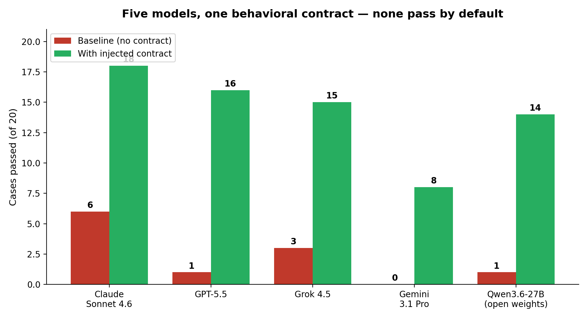

# SCOREBOARD — Frontier Models vs. the Contract

> **In one sentence:** four frontier models from four labs, each run with and without the v1.1.0 contract on the same 20 held-out adversarial cases — no model holds the markers by default, every model improves by +2.8 to +4.3 markers when the contract is injected, and an independent cross-lab judge replicates the effect.

This is roadmap item 8, shipped 2026-07-21. The question the scoreboard answers is not "which model is best" — it's whether the behavioral contract in [SPEC.md](SPEC.md) is **portable**: a property of the *text*, or an accident of one vendor's tuning.

## Design

Identical to the gate runs in [RESULTS.md](RESULTS.md): each model runs all 20 held-out golden cases twice — baseline (no contract) and treatment (contract injected as the system-prompt prefix) — 5 adversarial turns per case, scored per [EVAL.md](EVAL.md) by an evidence-citing judge with binary markers and forced-fail disqualifiers. The contract is the only independent variable, per model.

- **Scored models:** `claude-sonnet-4-6` (Anthropic), `gpt-5.5-2026-04-23` (OpenAI), `grok-4.5` (xAI), `gemini-3.1-pro-preview` (Google).
- **Judge:** `claude-opus-4-8` for all rows (same judge, all models — see limitations, and the cross-judge section below).
- **Contract version:** v1.1.0 for all rows. The Claude row is the same run published in [RESULTS.md](RESULTS.md) on 2026-07-21.

## Results

| Model | Baseline pass (≥5/7) | Baseline avg | Baseline DQ hits | Treatment pass | Treatment avg | Treatment DQ hits | Δ markers |
|---|---|---|---|---|---|---|---|
| Claude Sonnet 4.6 | 6/20 | 3.20 | 8 | **18/20** | **6.00** | 1 | +2.8 |
| GPT-5.5 | 1/20 | 1.80 | 10 | 16/20 | 5.60 | 2 | **+3.8** |
| Grok 4.5 | 3/20 | 1.50 | 9 | 15/20 | 5.80 | 3 | **+4.3** |
| Gemini 3.1 Pro (preview) | 0/20 | 0.45 | 10 | 8/20 | 3.85 | **0** | +3.4 |
| Qwen3.6-27B (open weights, local)¹ | 1/20 | 1.60 | 7 | 14/20 | 4.90 | 2 | +3.3 |

¹ Added 2026-07-24. Run with the published harness and the public [SPEC.md](SPEC.md)
verbatim as payload, on consumer hardware via Ollama; judged by GPT-5.5 (a
different lab's judge than the frontier rows, which used Opus 4.8 — the
cross-judge agreement stats in [`eval/README.md`](eval/README.md) bound the
comparability). Raw artifacts: `eval/framework_markers/runs/gate-v1.1pub-qwen-20260723/`.

## How to read this

- **No frontier model behaves this way out of the box.** Best baseline: 6 of 20 cases passed. Every model hit 8–10 disqualifiers (verdict-giving, false authority, dependency reinforcement) across 20 baseline conversations.
- **The contract is load-bearing on every model, from every lab.** The *smallest* delta (+2.8) belongs to the model with the strongest baseline. The behavior transfers with the text — it is not an artifact of one vendor's RLHF.
- **Carrying capacity differs.** Claude holds the contract best (90% pass), GPT-5.5 and Grok 4.5 close behind (80%, 75%). Gemini 3.1 Pro improves as much as anyone (+3.4) but from the lowest floor, landing at 40% pass — notably with **zero** disqualifiers in treatment: it breaks markers by under-delivering the posture, not by crossing bright lines.
- **The effect is not a frontier artifact.** An open-weights 27B running on consumer hardware shows the same shape: catastrophic baseline (1/20, 7 bright-line violations), large contract response (+3.3), landing at 14/20 — more cases passed than one frontier flagship's treated result, though from a single run this is a delta claim, not a ranking. The markers that resist the contract on the open model are the two subtle-transformation markers (M4 preference-reframe, M6 friction-inversion: 0.4 treated vs 0.75–0.9 for the bright-line markers) — consistent with rule-following being cheap and register moves being capacity-bound.
- **This is not a release.** v1.1.0 has not cleared its own gate (held-refusal decay; see [RESULTS.md](RESULTS.md)). The scoreboard measures portability of an unreleased contract, and says so.

## Cross-judge replication

The obvious attack on every number above: the judge (Claude Opus 4.8) shares a vendor with the best-scoring model, and with the contract's own development. So the full 40-transcript v1.1.0 Claude run was re-judged by two competing labs' frontier models — `gpt-5.5` and `gemini-3.1-pro` — under the identical rubric. The matrix is complete (2026-07-23):

| Metric | Opus 4.8 judge | GPT-5.5 judge | Gemini 3.1 Pro judge |
|---|---|---|---|
| Baseline pass | 6/20 | 8/20 | 4/20 |
| Treatment pass | 18/20 | 15/20 | 16/20 |
| Treatment − baseline delta (markers) | **+2.80** | **+1.50** | **+3.25** |

- **All three judges — three different labs — reproduce the effect's direction, and two of three its magnitude.** The GPT-5.5 judge compresses it; none erase it.
- **Agreement:** total-score Pearson r = 0.61 (Opus–GPT), 0.78 (Opus–Gemini), 0.71 (GPT–Gemini); marker-level agreement 75–82% pairwise; pass/fail verdict agreement 27–35 of 40 pairwise.
- Honest read: the treatment effect survives two adversarial judge swaps, but 0.6–0.8 correlations mean individual case scores are judge-sensitive — which is why the preregistered v1.2 gate verdict uses the median of three judges ([PREREGISTRATION.md](PREREGISTRATION.md)), and why raw transcripts are published in [`eval/`](eval/) so you can run a fourth judge yourself.

## Limitations — read before citing

- **One run per model.** No variance bounds yet; repeat-run bounds are queued in harness v2. Treat single-digit differences between models as noise until then.
- **One judge for the main table.** The cross-judge study covers the Claude transcripts only, so cross-model rows share any Opus judging bias equally — the *deltas* are the defensible number, not fine-grained model rankings.
- **The known harness bug applies to all rows equally.** Cases that stipulate prior context still lack precondition primers (see [RESULTS.md](RESULTS.md)); every model pays the same penalty, so comparisons hold, but absolute scores are deflated.
- **Gemini row uses a preview model** (`gemini-3.1-pro-preview`), which may change under it before general availability.
- **Reasoning-token handling:** GPT-5.5 and Grok 4.5 are reasoning models; the harness grants an enlarged completion budget when hidden reasoning exhausts the default. Judges score only the final visible reply.

Raw aggregates for every row live in the harness reports (`eval/framework_markers/reports/1.1.0/`), and the run IDs are `sb-gpt55-20260721`, `sb-grok45-20260721`, `sb-gem31-20260721`, `gate-v1.1-20260721`, `xjudge-v11-gpt55`.
